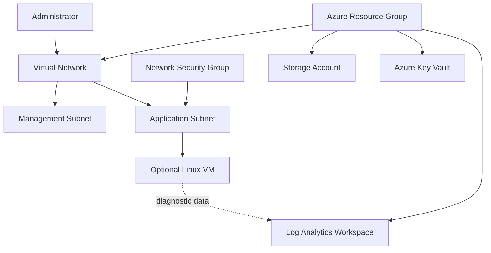

# Azure Infrastructure Foundation with Terraform

This repository provisions a small, secure Azure foundation for a web workload. It is designed as a portfolio project for Cloud Operations and Azure Infrastructure roles.

> Status: Infrastructure code only. Nothing is deployed until you run `terraform apply` using your own Azure subscription.

## What this demonstrates

- Azure resource organization with a resource group and consistent tagging
- Network design with separate application and management subnets
- Network Security Group (NSG) controls
- Azure Storage configured for secure access
- Azure Key Vault for secrets management
- Azure Monitor / Log Analytics workspace
- Optional private Linux virtual machine for administration and troubleshooting
- Repeatable Infrastructure as Code (IaC) using Terraform

## Architecture



## Prerequisites

- An Azure subscription with permission to create resources
- [Azure CLI](https://learn.microsoft.com/cli/azure/install-azure-cli)
- [Terraform](https://developer.hashicorp.com/terraform/install) 1.6 or newer
- An SSH public key if you enable the virtual machine

## Deploy safely

1. Sign in to Azure:

   ```bash
   az login
   az account show
   ```

2. Copy the example variables file:

   ```bash
   cp terraform.tfvars.example terraform.tfvars
   ```

3. Update `terraform.tfvars` with your Azure subscription details and a unique project name. To avoid VM cost while learning, leave `deploy_vm = false`.

4. Initialize and validate:

   ```bash
   terraform init
   terraform fmt -check
   terraform validate
   terraform plan -out tfplan
   ```

5. Review the plan carefully. Apply only when you understand the resources and costs:

   ```bash
   terraform apply tfplan
   ```

6. When finished, remove the resources to avoid charges:

   ```bash
   terraform destroy
   ```

## Security choices

- The storage account disables public blob access and enforces TLS 1.2.
- The Key Vault uses RBAC authorization and disables public network access by default.
- The virtual machine has no public IP address.
- Secrets, `.tfvars`, state files, and SSH keys are excluded from Git.

## Repository layout

```text
.
├── main.tf                 # Resource group, network, storage, Key Vault, monitoring
├── variables.tf            # Inputs and validation
├── outputs.tf              # Useful resource identifiers
├── versions.tf             # Terraform and provider versions
├── terraform.tfvars.example
└── .gitignore
```

## Interview talking points

1. Why use IaC? It makes infrastructure repeatable, reviewable, and less error-prone than manual portal changes.
2. Why separate subnets? It helps isolate workloads and apply different network controls.
3. Why no public VM IP? Administrative access should be controlled through secure private connectivity such as Azure Bastion, VPN, or a company jump host.
4. Why disable public blob access? It reduces accidental exposure of data in storage.
