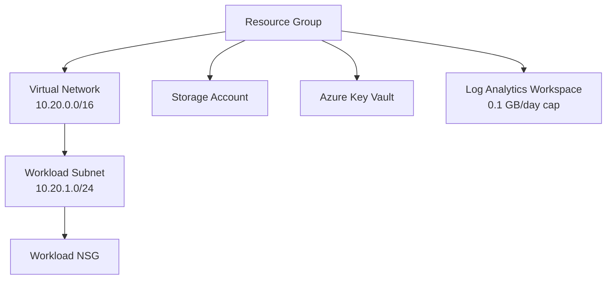

# Azure Terraform Foundation

A hands-on Azure Infrastructure as Code project built using Terraform.

## Overview

This project deploys a secure Azure foundation with reusable Terraform variables, standardized tags, networking, storage, secrets management, and monitoring.

## Architecture

```text
Resource Group
├── Virtual Network: 10.20.0.0/16
│   └── Workload Subnet: 10.20.1.0/24
│       └── Workload Network Security Group
├── Storage Account
├── Azure Key Vault
└── Log Analytics Workspace
```



## Resources Created

- Azure Resource Group with standardized tags
- Azure Virtual Network and workload subnet
- Network Security Group associated with the workload subnet
- Standard LRS Storage Account
- Azure Key Vault with RBAC authorization enabled
- Terraform outputs for key resource names and IDs
- Log Analytics Workspace with a 30-day retention period and 0.1 GB/day ingestion cap

## Security Practices

- HTTPS-only Storage Account traffic
- Minimum TLS version 1.2
- Public blob access disabled
- Key Vault uses RBAC authorization
- Terraform state files excluded from Git
- Key Vault configured for safe cleanup during lab destruction

## Tools Used

- Terraform
- Microsoft Azure
- Azure CLI
- Git and GitHub
- Visual Studio Code

## How to Run

```powershell
terraform init
terraform fmt
terraform validate
terraform plan
terraform apply
```

## Verify Deployed Resources

```powershell
terraform state list
terraform output
```

## Cleanup

```powershell
terraform plan -destroy
terraform destroy
```

## Cost Controls

- Log Analytics ingestion is capped at 0.1 GB per day.
- No diagnostic settings, agents, or application services are connected to send logs.
- Azure budget alerts are enabled for the subscription.
- All resources can be removed safely with `terraform destroy`.

## Learning Outcomes

- Built Azure infrastructure from scratch using Terraform.
- Used variables and local values to standardize configuration.
- Used Terraform references to connect dependent resources.
- Applied secure-by-default settings for Storage Account and Key Vault.
- Used Git and GitHub to version Infrastructure as Code.
- Practiced plan, apply, output, and destroy workflows.
- Created a Log Analytics Workspace with a controlled daily ingestion limit.